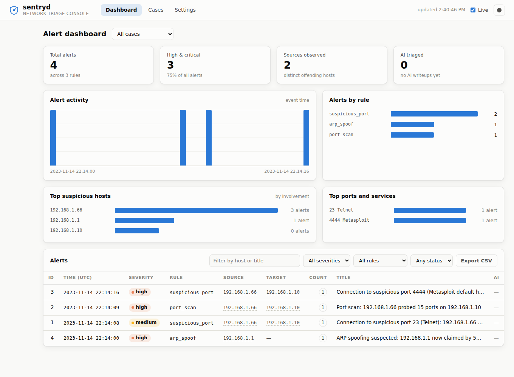
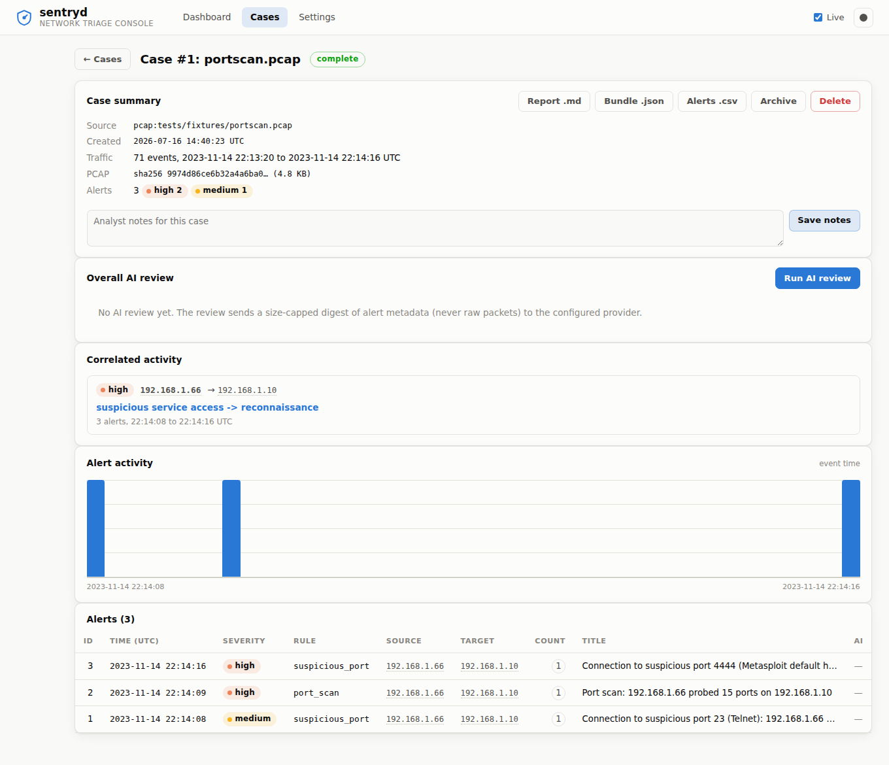
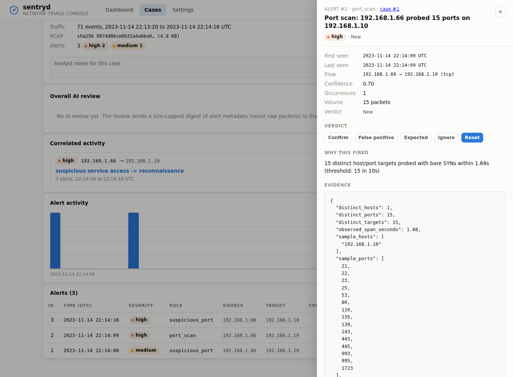

# sentryd

Network anomaly detection with deterministic, rule-based detection and an
optional AI triage layer that writes analyst-style explanations of alerts.

**Design principle: rules detect, AI explains.** Every detection is made by
explainable, testable rule logic that runs entirely offline. The AI layer
annotates alerts after they exist, it never influences whether something is
detected, and the whole tool works with no API key configured.



```
 input sources                 core                       consumers
┌─────────────────┐   ┌─────────────────────┐   ┌─────────────────────────┐
│ pcap replay     │   │ normalized Events   │   │ SQLite alert store      │
│ live capture    │──▶│        ↓            │──▶│ terminal dashboard      │
│ log tailing     │   │ rule engine + dedup │   │ web UI (FastAPI)        │
└─────────────────┘   └─────────────────────┘   └─────────────────────────┘
                                                            ↑
                                     AI triage (optional) ──┘
                                     OpenRouter, or a no-op without a key
```

## Detection rules

| rule | what it catches | technique |
|---|---|---|
| `port_scan` | vertical scans, horizontal sweeps | sliding window of SYN-only attempts; distinct (host, port) targets per source |
| `traffic_spike` | floods, exfil bursts | per-host EWMA baseline per time bucket; ratio threshold + absolute floor |
| `arp_spoof` | ARP cache poisoning / MITM | IP→MAC conflict tracking over ARP announcements; gratuitous-ARP flood detection |
| `suspicious_port` | known-bad ports (4444, 31337, telnet, …) | config-driven watchlist with per-port severity and analyst notes |
| `signature` | anything stateless you can describe | YAML signatures: protocol, CIDRs, port ranges, TCP flags |

Every alert carries a rule id, severity, confidence, and concrete evidence
(the ports probed, both MACs, the byte counts), enough for an analyst to
verify the finding without any AI. Thresholds and watchlists live in
[`config/signatures.yaml`](config/signatures.yaml), not in code.

## Setup

Requires Python 3.11+ and [uv](https://docs.astral.sh/uv/) (or plain pip).

```bash
git clone https://github.com/H4ch1Net/sentryd && cd sentryd
uv sync
uv run pytest        # fully offline
make demo            # replay the bundled capture into a case
make web             # console on http://127.0.0.1:8000
```

### Run with Docker

```bash
docker compose up --build     # console on http://localhost:8000
```

Data (the SQLite db and uploaded pcaps) persists in a named volume. To enable
AI triage, copy `.env.example` to `.env` and set `OPENROUTER_API_KEY`. To
require an API token when exposing the port, set `SENTRYD_API_TOKEN`.

## Cases: one run, one workspace

Every replay or capture becomes a **case**. Alerts belong to the case that
produced them, so runs never blur together, old work can be archived or
cleared, and the overall AI review has a natural scope. A case records its
source, PCAP sha256/size, event count, event-time span, status, notes, and
the AI report once generated.

## Quickstart demo (~2 minutes, no root, no API key)

Replay the committed synthetic capture (background browsing with a port scan
and a Metasploit-handler connection hidden in it):

```bash
uv run sentryd replay tests/fixtures/portscan.pcap
```

Three alerts fire: a Telnet probe (medium), the port scan (high), and a
connection to 4444 (high). Each run prints its case id. Inspect it:

```bash
uv run sentryd cases show 1          # metadata, correlated activity, alerts
uv run sentryd alerts show 2         # first/last seen, why it fired, evidence, next step
uv run sentryd alerts list --case 1
```

`alerts show` explains each alert: first/last seen, flow with ports and
protocol, the exact reason the rule fired (with its numbers), related alerts
on the same hosts, and a suggested next investigation command.

Watch a replay live in the terminal dashboard (timed playback; Enter drills
into any alert, q quits):

```bash
uv run sentryd dash --pcap tests/fixtures/arpspoof.pcap --speed 4
```

Or open the web console (upload captures, browse cases, run reviews):

```bash
uv run sentryd web            # then open http://127.0.0.1:8000
```

## Overall AI review

Per-alert triage explains one finding; **overall review** summarizes a whole
case. It builds a size-capped digest of alert metadata (severity counts, top
hosts and ports, correlated clusters, a timeline, and a ranked sample of
alerts with trimmed evidence) and asks the AI for a structured report:
executive summary, likely attack chain, top suspicious hosts, top ports and
services, timeline, confidence, what to investigate next, and possible false
positives.

Only that digest is sent, never raw packets, and only when you run the
command. Without an API key detection and evidence are unchanged; the review
just is not available.

```bash
cp .env.example .env                 # add your OpenRouter key
uv run sentryd triage 2              # explain a single alert
uv run sentryd triage latest         # review the newest case
uv run sentryd triage --case 1       # review a specific case
uv run sentryd triage --pcap cap.pcap  # replay into a new case, then review
uv run sentryd triage --case 1 --json  # machine-readable
```

## Exports

```bash
uv run sentryd export alerts --format csv -o alerts.csv
uv run sentryd export alerts --format json --case 1
uv run sentryd export case 1 --format md -o report.md   # analyst report
uv run sentryd export case 1 --format json              # full bundle
```

The markdown case report is a complete analyst artifact on its own; when an
AI review exists it is appended as a clearly labeled section. In the web UI
the same exports are download buttons on the case page.

## Rules tooling

```bash
uv run sentryd rules list                              # all rules, enabled state, settings
uv run sentryd rules explain suspicious_port           # what it detects + thresholds
uv run sentryd rules lint                              # validate config and signatures
uv run sentryd rules test --rule port_scan --pcap cap.pcap  # dry run, nothing stored
```

## Input sources

```bash
uv run sentryd replay capture.pcap        # offline pcap/pcapng replay
sudo uv run sentryd sniff -i eth0         # live capture (root required)
uv run sentryd tail traffic.log           # follow a JSON-lines traffic log
```

Live capture without root fails with advice, not a traceback. The log format
is one JSON object per line (`ts`, `protocol`, `src_ip`, `dst_ip`,
`src_port`, `dst_port`, `tcp_flags`, `length`); unparseable lines are
skipped and counted.

All three sources normalize into the same `Event` stream, so every rule
behaves identically regardless of input, and pcap replay in tests exercises
the exact code that runs on live traffic.

## Web UI

`sentryd web` serves a single-page console (plain HTML/CSS/JS, no build step)
plus the REST API. It has three views:

- **Dashboard**: KPI tiles, an alert-activity timeline, per-rule breakdown,
  and a filterable alert table, scoped to all cases or one.
- **Cases**: drag-and-drop PCAP upload (or a server-side path for advanced
  users) that creates a case and replays it in the background with live
  progress, plus the case list.
- **Case detail**: summary and metadata, editable notes, correlated activity
  with attack-chain labels, per-case timeline and alerts, export buttons, and
  an **Overall AI Review** button that renders the sectioned report.
- **Settings**: instance status, per-rule on/off toggles, and the theme
  switch.

Alert and host detail open in a slide-over drawer with the verdict controls.
The UI is light/dark themed and degrades to clear messages when AI is not
configured.





## Interpreting alerts

Each alert answers three questions before you touch the AI layer:

- **What fired and why.** The rule id and a plain-language reason with the
  actual numbers (for example, "15 distinct host/port targets probed with bare
  SYNs within 1.68s"). Severity is the rule's assessment of impact; confidence
  is how strongly the evidence matched (it rises the further past threshold the
  activity is).
- **The evidence.** Concrete fields an analyst can verify independently: ports
  probed, both MACs in an ARP conflict, byte/packet counts, sampled flows. No
  AI is needed to confirm the finding.
- **What to do next.** A suggested investigation command (sentryd filters or a
  `tshark` display filter) and the related alerts on the same hosts.

Work a case by assigning a **verdict** to each alert (confirmed, false
positive, expected, ignored, dismissed) from the drawer or
`sentryd alerts status <id> <verdict>`. Verdicts are independent of AI triage,
so marking something a false positive never depends on a provider being
configured.

**A typical workflow:** upload a capture on the Cases page, wait for the
replay to finish, open the case, read the correlated activity to see the
attack chain, run the Overall AI Review for a narrative, mark the benign hits
as false positives, and export the case report (`.md`) or alerts (`.csv`).

## HTTP API

Interactive OpenAPI docs are served at `/docs`. Core endpoints:

| method | path | purpose |
|---|---|---|
| POST | `/api/pcaps/upload` | upload a .pcap/.pcapng, creates a case and replays it |
| POST | `/api/replay` | replay a server-side path (`{"path": ...}`) |
| GET | `/api/cases/{id}/status` | replay progress and status |
| GET | `/api/cases` / `/api/cases/{id}` | list cases / case detail with clusters and stats |
| POST | `/api/cases/{id}/archive` | archive a case |
| DELETE | `/api/cases/{id}` | delete a case and its alerts |
| GET | `/api/alerts` / `/api/alerts/{id}` | list (filters: severity/rule/status/case/host) / detail with related + hint |
| POST | `/api/alerts/{id}/status` | set the analyst verdict |
| POST | `/api/alerts/{id}/explain` | AI writeup for one alert |
| POST | `/api/cases/{id}/triage` | overall AI review of a case |
| GET | `/api/cases/{id}/report?format=md\|json` | case report download |
| GET | `/api/export/alerts?format=json\|csv` | alert export download |
| GET | `/api/rules` / `POST /api/rules/{id}/toggle` | effective rule config / enable-disable |
| GET | `/api/hosts/{ip}` / `/api/status` | host summary / instance status |

AI endpoints return `503` with a clear message when no provider is
configured; detection and export endpoints never need one.

**Hardening.** The API binds to `127.0.0.1` by default. Set
`SENTRYD_API_TOKEN` to require an `Authorization: Bearer <token>` header on
`/api/*`, and `SENTRYD_PCAP_DIR` to allow server-side replay from a directory
other than the uploads sandbox. Put TLS or a reverse proxy in front before
exposing it.

## Terminal and web parity

Both interfaces expose the same core capabilities over one engine and store:

| capability | CLI | Web UI |
|---|---|---|
| replay / upload a PCAP | `replay` | Cases upload or server path |
| list and filter alerts | `alerts list` | Dashboard table |
| alert detail (evidence, why, next step) | `alerts show` | alert drawer |
| cases: list / show / archive / delete / notes / clear | `cases ...` | Cases + case detail |
| set alert verdict | `alerts status <id> <verdict>` | drawer verdict buttons |
| per-alert AI explanation | `triage <id>` | Explain button |
| overall AI review | `triage latest\|--case\|--pcap` | Overall AI Review button |
| host summary | (in `alerts show` related) | host drawer |
| exports (json/csv/md) | `export ...` | case page download buttons |
| rules: list / explain / lint / test | `rules ...` | Settings (list) / `GET /api/rules` |
| enable / disable rules | `rules enable/disable` | Settings toggles |
| live monitor | `dash` (Textual) | dashboard auto-refresh |

The Textual `dash` is the live-monitor view and is CLI-only by nature; rule
`explain`/`lint`/`test` stay in the CLI (config authoring), while enabling and
disabling rules works in both. Rule thresholds live in
`config/signatures.yaml` to keep configuration reviewable in version control.

## Configuration

`config/signatures.yaml` overrides the packaged defaults (deep-merged, so
override only what you need): rule thresholds, the suspicious-port
watchlist, engine dedup cooldown, and custom signatures:

```yaml
rules:
  port_scan:
    min_distinct_targets: 10   # more sensitive than the default 15

signatures:
  - id: sig-rdp-inbound
    title: Inbound RDP connection attempt
    severity: high
    match:
      protocol: tcp
      dst_ports: [3389, "5900-5910"]
      tcp_flags: S
      tcp_flags_not: A
```

## Project layout

```
src/sentryd/
├── core/        Event, Alert, Case models, rule engine, correlation
├── sources/     pcap replay, live capture, log tailing into Events
├── rules/       one module per detection rule + config-driven signatures
├── triage/      TriageProvider protocol, OpenRouter impl, digest + review
├── storage/     SQLite alert/case store (stdlib sqlite3, in-place migration)
├── runner.py    case orchestration shared by CLI and web
├── export.py    JSON/CSV/markdown exports
├── dashboard/   Textual terminal UI
└── web/         FastAPI REST API + static single-page console
tests/           per-rule positive/negative tests, synthetic pcap fixtures
```

Architecture notes for contributors are in [AGENTS.md](AGENTS.md).

## Testing

```bash
uv run pytest
```

The suite is fully offline: rules are tested against hand-built events and
scapy-crafted synthetic pcaps (both attack and benign traffic, every rule
has "must not fire" cases), the AI provider against a mock HTTP transport
including every failure mode, and both UIs headlessly. Committed demo pcaps
are synthetic and regenerable with `uv run python tests/fixtures/generate.py`.
